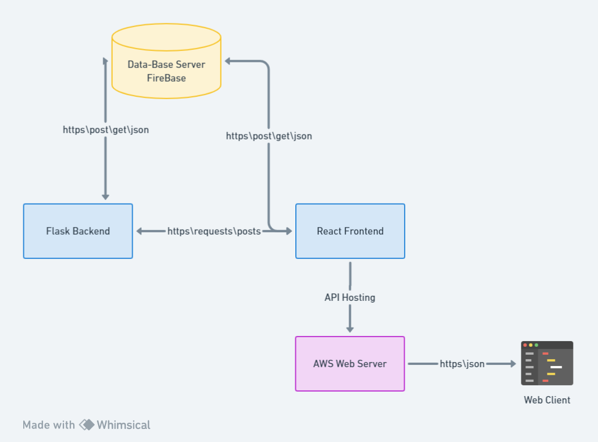
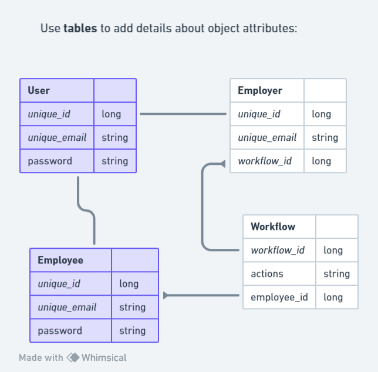
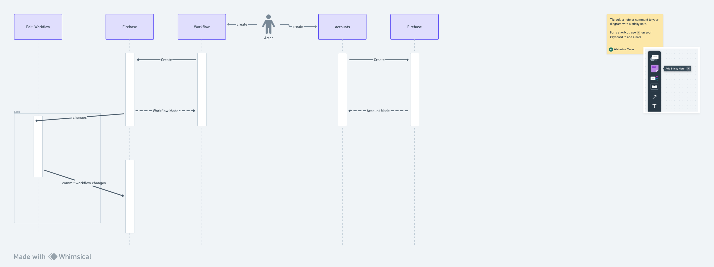

# Forum Application Architecture

This document describes the overall architecture of the Forum Application. 

## Highlevel Component Diagram

The diagram shows the firebase server we use for our database. Then both our frontend and backend servers connect to the database to get user informations. Afterwards the react frontend and flask backend work together to display and make/change the workflows our server has. Afterwards we will host that to the AWS cloud server. Then it connects to a web client through the network

## Relationship Diagram

There is a User object which can be connected into the Employee and Employer Objects. The Employer can make workflows that automates their hiring processes. Each Employer can make many workflows, and the workflows can be connected to many employees

## Flow Diagram

There is a User that can create accounts that is then updated to the Firebase server. Then the User can also create workflows and edit the workflows made.
