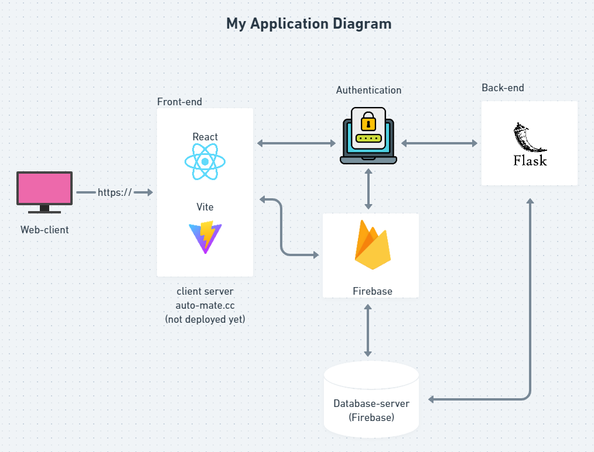
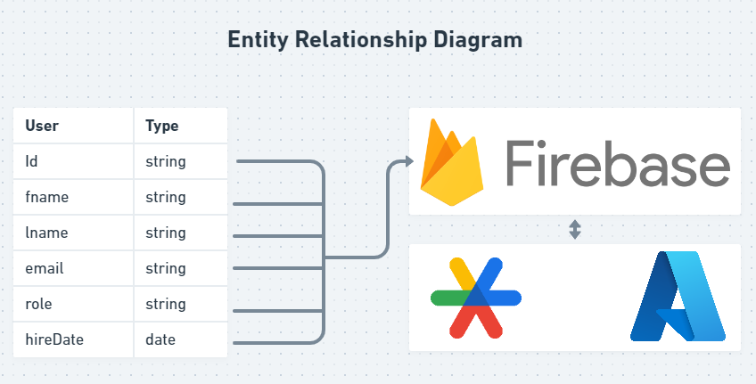

# ASSIGNMENT 9

## STEP 1

The project's name is Automata, a project that allows us to create workflows to automate employees management paperwork. We used react vite for our front-end for fast server rendering and Flask for our back-end which is still not worked on yet. So at the moment the backend queries including login, register and auth are handled by firebase as well as the data storing.

## STEP 2

For this project, we decided to go for a non-relational database design. The choice was between mongodb or firebase but we went for firebase instead. The technically do have a user model that has the attributes first and last name, email and password, created date and last sign in data. role (admin (HR) or employee). We're using the google auth provider and microsoft Azure to sign in as well.
