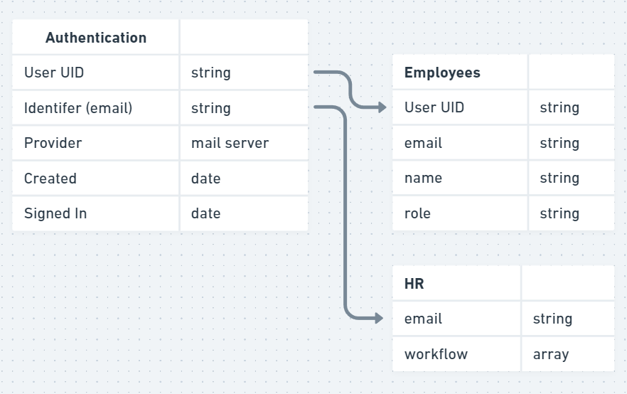
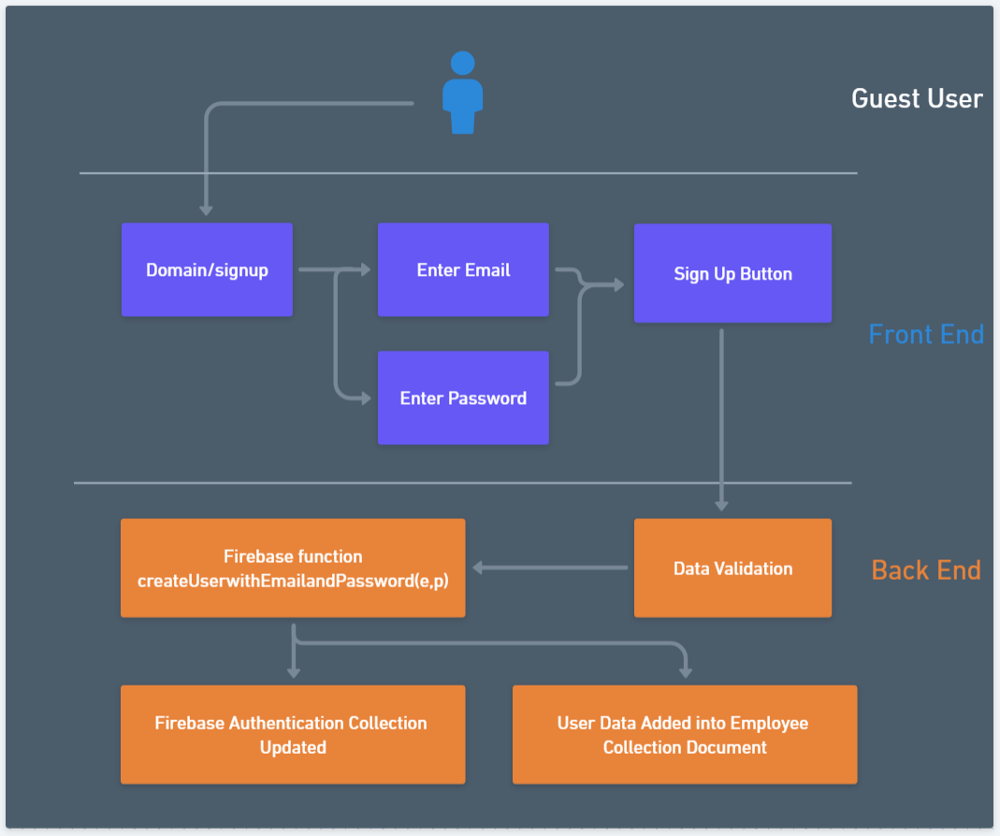

# Automate Application Architecture

This document describes the overall architecture of the Forum Application. 

## Highlevel Component Digram

For this project we are using React.js for our front end and Firebase as our backend/server querying
at the moment. React is node based therefore I wrapped the entire project within Node. In order
for us to render out our components and provide rouing for our index we must use a root render which
houses the React DOM browser router. The browser router also linked with the library react-router-dom
provides easy of use pathing. Within the React DOM is housed the User Autenication Context Provider
component which handles the firebase authenication system via protected routing and firebase authenication functions, and connection to firebase database for querying and writing data. The User Auth is the most important of this since it is used to ensure a user is actually valid and relys on the trust of google's
plateform to confirm this for us. Within this user auth context we house every other component which would
be the Navbar along with the Routing. The navbar is simple and renders different attributes depending if
a user is logged in or not. As for the Routing is handles both normal hyperlinking and protected ones. The main difference is that the protected routing requires authenication of user to be valid (i.e. logged in).
The normal routing is mainly for pages/components that deal with loose data that is needed to provide context to our website (i.e landing page, login, signup, password reset). Data that essentially does not
need to be protected. Now protected routing handles the opposite in our case the workflow builder component page and profile page.

## Relationship Digram

For this project the team decided on a noSQL database which was Google's Firebase. Given
the noSQL attributes are still assigned to our entity's and do have a relationship when
we build our data. When a user signs up, within Firebase's authentication system each user
is assigned attributes. For each user there is a unique identifying string, their email, provider
( this implies method of login so via email ), created date, and signed in (latest date). 

For our employee onboarding workflow, when the HR team creates a user they must provide email, name, 
and role for the employee. When we trigger the create account method using firebase's service
provider functions, we take the unique User UID from the authentication system and set it
as the document name within the Employee collection and include it within the document fields
for easy querying. 

For our HR collection, if the role HR is chosen for the employee onboarding, a new document
will be created for the new HR and instead of using the User UID from authentication, we pass
the email as the identfying unique document name, and provide that information in the document's 
field as well (for easy querying) along with a workflow array when a workflow gets saved. Workflow
is an array since we parse through the information within the list to determine the workflow actions
without having to create new field for each trigger/actions.

## Flow Diagram

For this flow diagram, A non user (guest user you could say) directs themself to the /signup hyperlink of our domain. Once in the signup page, they are treated with two input boxes one for email and password. Once the non user enters said information and clicks the sign up button the back end does the rest of the work. Essentially it passes said parameters into the firebase createUserWithEmailandPassword function and if the email does not exist, and the password is greater than 6 characters, the data is validated and cretes the user in the authentication collection along with a custom collection for user/employee data.

