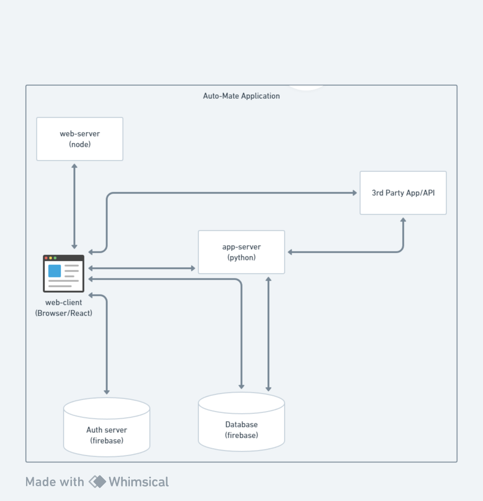
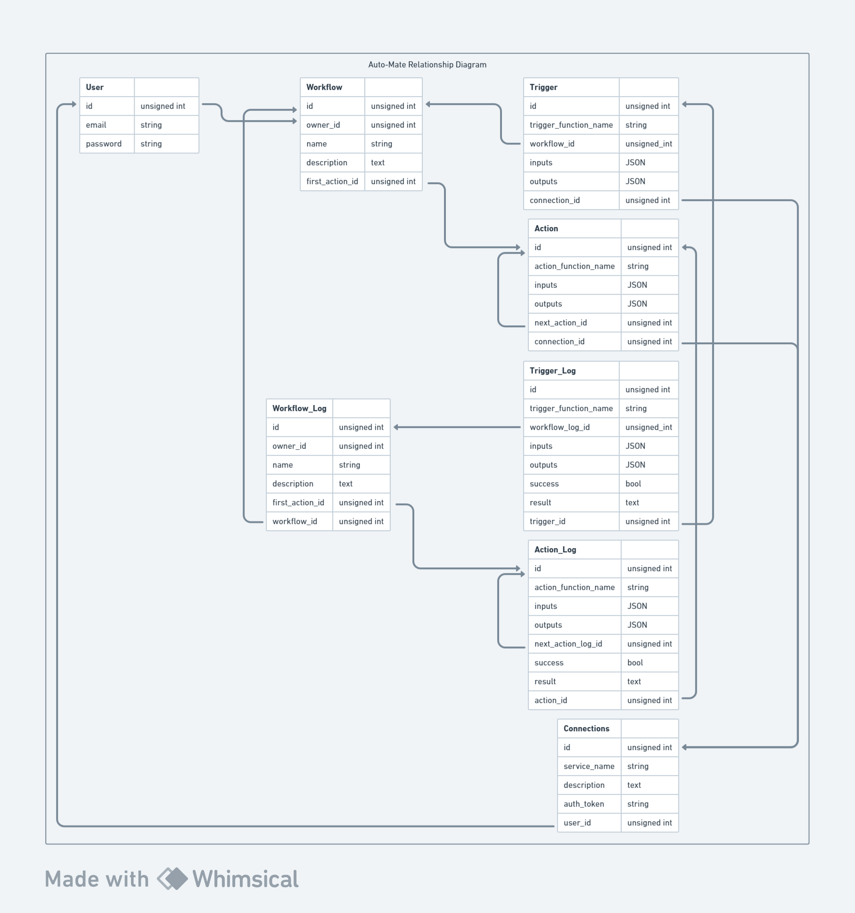
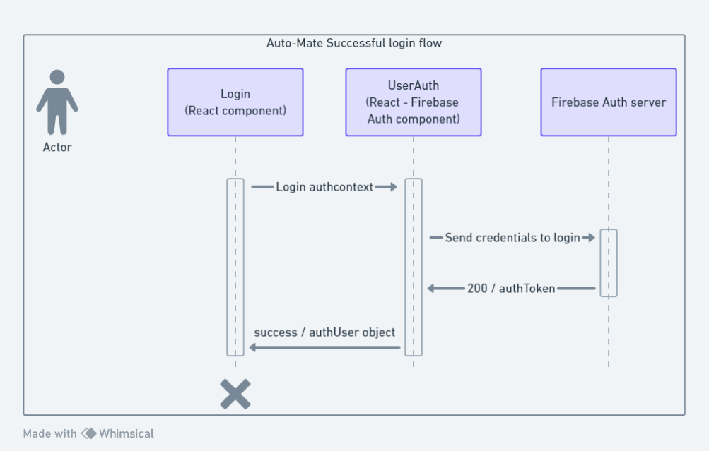

# AutoMate Application Architecture
This document describes the overall architecture of the AutoMate Application.

## Highlevel Component Digram
There are 4 components, with one component being a generic "third party".
The three main components are as follows
### client-app
This is the react frontend that runs within a users browser. This is served to them via a simple web server
### app-server
This is the backend running on python/flask and handles running workflows when triggered
### firebase
This is our database, which handles authentication and storage. Only the frontend needs to authenticate, while both the frontend and backend nened to access the database. The frontend is used to create, edit, delete, view run history for workflows. While the backend is used to run workflows once they are triggered, then update the database with the results.

## Relationship Diagram
Users have app connections and workflows. Connections are the tokens used to connect to a third party.
Workflows have many triggers that can start them, along with some amount of actions that follow. Only the first action is stored because each action knows the following action that needs to occur.
There are also associated tables to log the results of a workflow, the trigger and actions that occured during a run.

## Flow Diagram
This describes a successful login attempt by a user. From the login page/react component they enter their credentials and press the login button which calls the login function within the auth context. From here the firebase auth component is called and sends their credentials to the firebase auth server. The auth server responds with a 200 status code, and the associated authToken, which is then decoded in the auth component into the user object and then passed back to the login component with the success state and user object.

