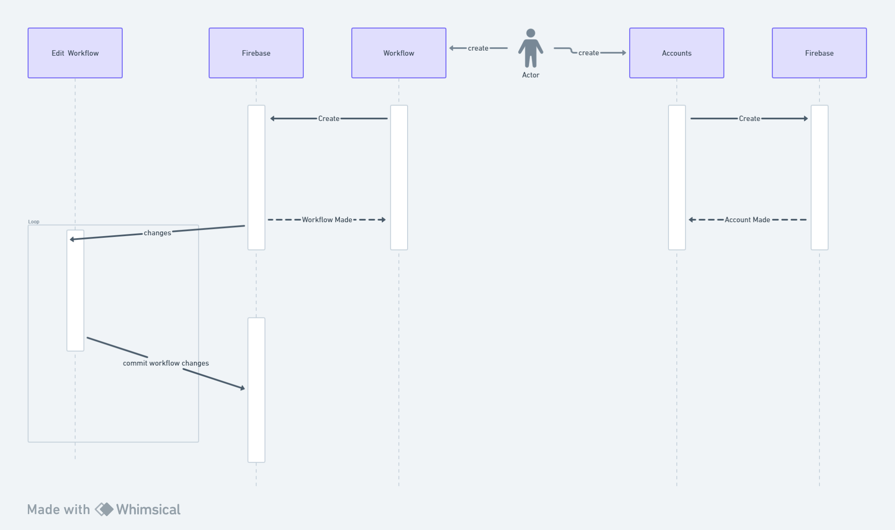

# Auto Mate Architecture

This document describes the overall system architecture of the Auto Mate Web Application.

## High-level Component Diagram

In the Auto Mate application, the user is able to use the web interface/browser to send requests to the web server, the web server then transfer requests to the frontend app. When the frontend app receives the requests, it will make requests to the backend server for data. The backend server will process the requests and access the database to retrieve/modify the data, and send data back to frontend. The frontend will receive the data and send them back to the web server to send responses to user on the web interface.

## Entity Diagram

The User entity is the authentication data for the users using the Auto Mate platform, each user has an unique UID, with their email, password, date of signed in, and date of created. The User entity is one to many to the Workflow entity because one user may have more than one workflows saved in their account. The Workflow entity is the workflow created by the users, each workflow has an unique ID with its name and tasks. The Workflow entity is one to one to Employee Info entity because every workflow is responsible for onboarding only one employee, so requiring only one employee info. The Employee Info holds employee data for the workflows, each employee info has an unique ID with its name, email, and role of that employee.

## Flow Diagram

An user (who doesn't have an account) will sign up to get their new account, then is able to log in using that account and has the option to log out. When logged in, the user is able to access the dashboard and create workflows for onboarding a new employee. Once a workflow is created, the user can then execute the workflow to perform the onboarding tasks, and responses will be sent back to the user upon finishing the tasks.